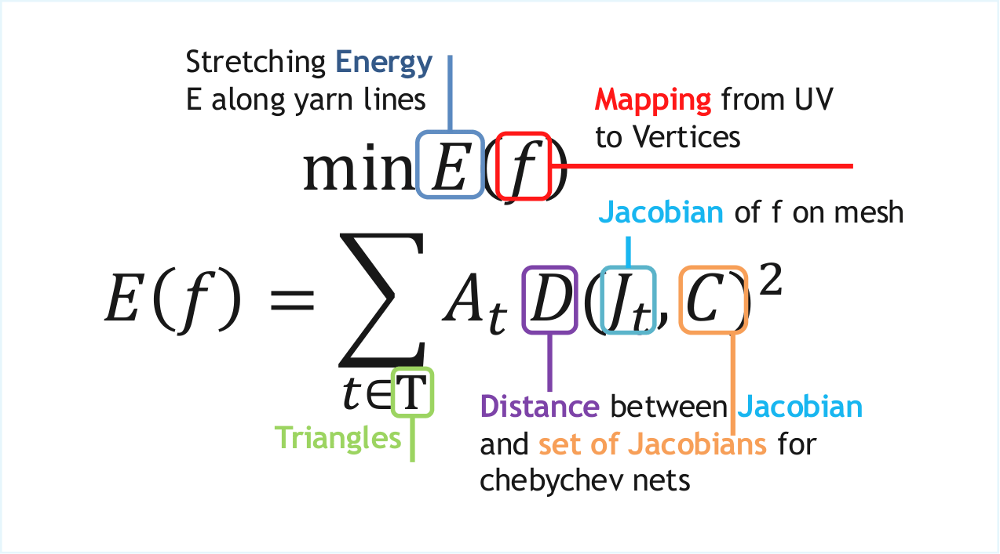
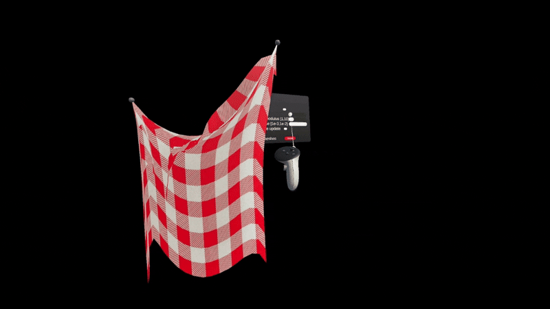

Digital garment modelling in VR (short dgmvr) is a cloth simulation tool in VR developed as a semester thesis at the Interactive Geometry Lab at ETH Zurich.

<div align="center">
 
 Showcase with gravity and no regularization
</div>

## Method

### Existing methods and VR implementations

<!-- What to solve slide; Pseudo code for algorithm -->

There are many different approaches used to simulate fabrics (table links either to paper about method or an vr implementation if it exist)

| Method                      | Fast | Precise | Anisotropic deformations |
|-----------------------------|:----:|:-------:|:------------------------:|
| Mass spring systems [\[1\]](https://github.com/Matusson/UCloth/tree/master​)   | ✓    | 𐤕       | 𐤕                        |
| Finite element method [\[2\]](https://animation.rwth-aachen.de/media/papers/2013-CAG-AdaptiveCloth.pdf)   | 𐤕    | ✓       | ✓                        |
| Yarn level simulation [\[3\]](https://dl.acm.org/doi/10.1145/2661229.2661279)   | 𐤕    | ✓       | ✓                        |
| Position based dynamics [\[4\]](https://github.com/yesongO/cloth-vr-simulation​) | ✓    | ~       | 𐤕                        |
| Chebshev [\[5\]](https://igl.ethz.ch/projects/chebyshev/)                | ✓    | ✓       | ✓                        |

### Chebyshev deformation
The goal of the semester thesis was to implement the Chebyshev deformation (introduced by Annika Öehri [here](https://igl.ethz.ch/projects/chebyshev/)) in Unity. The goal of the method is to solve minimize following energy describing the stretching of our mesh along the yarn lines.

<div align="center">
  
  Equation to minimize
</div>

Here C is the set of jakobians for deformations we want to allow. To minimize the energy a local global approach can be used. The local step (1,2) are independent for each triangle and the global solve (3) corresponds to a sparse solve of a symmetric matrix. The pseudo code is as follows:

```
foreach iteration step
  1. Compute jakobian J_t
  2. Solve local step c_t = min_{c ∈ 𝐶} ||J_t - c||_f
  3. Minimize SUM_{t ∈ T} A_t c_t 
  4. Recompute velocity
```

Position constraints can be enforced by clever substitution and we can add gravity by changing the free vertices before the solve (not constrained/pinned by user). One important thing if gravity is added, our cloth can collapse into a line (still in set C), thus regularizer's are needed that slightly bias our c_t towards rotations only without deformations (method use ARAP for this).  

### Showcase

<div align="center">
 
 Showcase without gravity or regularization

 
 Showcase with gravity and regularization
</div>

## Implementation

<!-- How to do numerical simulation in Unity -->
The project was made in Unity 5 and supports Meta's headsets with the Meta Quest 3 being tested. It runs via the Link (due to how the simulation code is compiled currently). While C# has numerics libraries, they all have some drawbacks.

| Library          | Flaw                                       |
|------------------|--------------------------------------------|
| [Numerics.Net](https://numerics.net/) | Not free                                   |
| [Alglib](https://www.alglib.net/)       | BLAS level (no easy sparse x sparse mult.) |
| [Math.Net](https://numerics.mathdotnet.com/)     | No sparse factorization                    |

Instead the project relies on Unity's support for external C++ dll, handling the whole simulation in C++ with [Eigen](https://libeigen.gitlab.io/) and [Libigl](https://libigl.github.io/) while passing the mesh data between each other. The simulation supports grabbing handles and changing different parameters (stiffness, regularization strength, gravity strength) and does one iteration per frame.

The code of this project is hosted on [Github](https://github.com/Klark007/dgmvr).