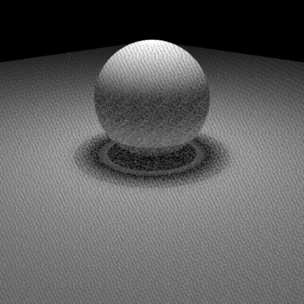
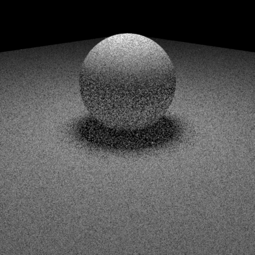

<link rel="stylesheet" type="text/css" href="/beerslider/BeerSlider.css">

In ETH's computer graphics course, we were given a basic pathtracer ([Nori](https://wjakob.github.io/nori/)) and were tasked with extending it first through the multiple homeworks and later in a final project. The preexisting code already supported loading of models, ray triangle intersections and BVH acceleration. During the homeworks we implemented features such as diffuse, specular and dielectic materials (with multiple importance sampling), and photon mapping. The final project was a project done as a group of two where we could pick and choose different rendering features to add to our codebase. I will now discuss the interesting features implemented by me.

## Halton Sampling
We replace Uniform sampling with Halton sampling due to its low discrepancy. Halton sampling is done using [Halton Sequences](https://en.wikipedia.org/wiki/Halton_sequence). For a sample we compute the n-th number (index) in the halton sequence of base k. For the next sample we use the next prime as base. To avoid correlation we pick a random index depending on the pixel position and permute the sequence of prime bases.

  
  

  Uniform (top) compared to Halton sampling (bottom; base 2 and 3)

<!-- 
If we always start this sequence at the same index and base for all pixels, we get artifacts due to them all generating the same random numbers. This can be fixed by using a random index per pixel.

  

Another issue arises due to some consecutive prime base being correlated. To fix this we permute the sequence of prime bases.

    
    
    Correlation (top) and render without permutations (bottom)

-->

Here a comparison between uniform and halton sampling both with 16 sample per pixel (spp).

  

  

    
  

While Halton sampling is more expensive it still performs better when compared to uniform sampling using the same render time of 1.2 min. The Independent sampler used 1412 spp and Halton 1024.

  

  

    
  

## Disney BRDF

## Heterogeneous Participating Media

<!-- Mention delta tracking, phase functions -->