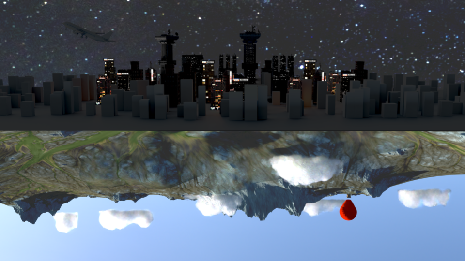
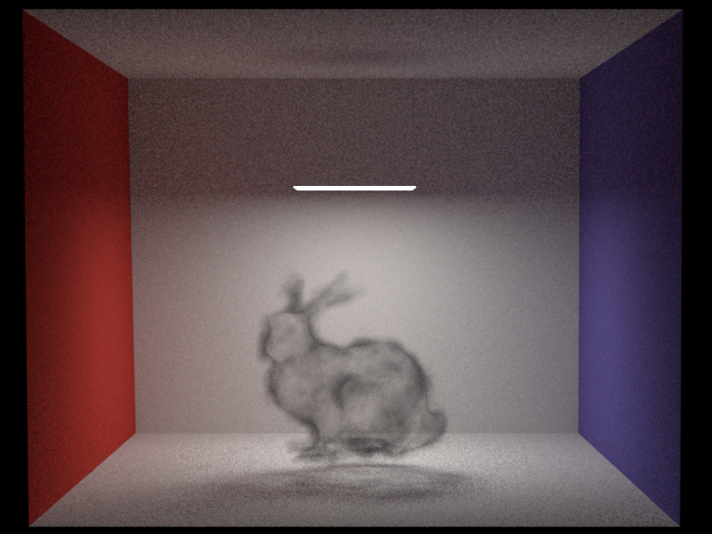

<link rel="stylesheet" type="text/css" href="/portfolio_hugo/beerslider/BeerSlider.css">

A physically based pathtracer built in C++ as part of ETH Zürich's computer graphics course, extended with advanced rendering features including volumetric media, Disney BRDF, and low-discrepancy sampling. The renderer is based on [Nori](https://wjakob.github.io/nori/), a minimal pathtracer 
framework providing model loading, ray-triangle intersection, and BVH acceleration. During the homeworks I implemented features such as diffuse, specular and dielectic materials (with multiple importance sampling), and photon mapping. he final project was done in a group 
of two with my friend contributed environment map and many-light sampling.

    
    Final renderer

I will now discuss the interesting features implemented by me.

## Halton Sampling
We replace Uniform sampling with Halton sampling due to its low discrepancy. Halton sampling is done using [Halton Sequences](https://en.wikipedia.org/wiki/Halton_sequence). For a sample we compute the n-th number (index) in the halton sequence of base k. For the next sample we use the next prime as base. To avoid correlation we pick a random index depending on the pixel position and permute the sequence of prime bases.

  
  

  Uniform (top) compared to Halton sampling (bottom; base 2 and 3)

Here a comparison between uniform and halton sampling both with 16 sample per pixel (spp).

  

  

    
  

While Halton sampling is more expensive it still performs better when compared to uniform sampling using the same render time of 1.2 min. The Independent sampler used 1412 spp and Halton 1024.

  

  

    
  

## Disney BRDF
I implemented the Disney BRDF with the parameters: Roughness, Metallic, Anisotropic, Sheen, Sheen Tint. To check the correctness I compared my rendering with [Mitsuba](https://www.mitsuba-renderer.org/) using a mesh from [here](https://casual-effects.com/data/). Anistropic materials  needed consistent tangent frames so I implemented [Computing Tangent Space Basis Vectors for an Arbitrary Mesh](https://www.cs.upc.edu/~virtual/G/1.%20Teoria/06.%20Textures/Tangent%20Space%20Calculation.pdf).

  

  

    
  

Also important to add was texture support for the materials.

  

  

    
  

## Heterogeneous Participating Media
Heterogeneous participating media is rendered using delta tracking and supports isotropic and Henyey-Greenstein phase functions. The code uses [nanovdb](https://github.com/AcademySoftwareFoundation/openvdb/blob/master/doc/nanovdb/doc.md) for loading the volume.

  

  Volume with Henyey-Greenstein phase function (g = 0.8)

