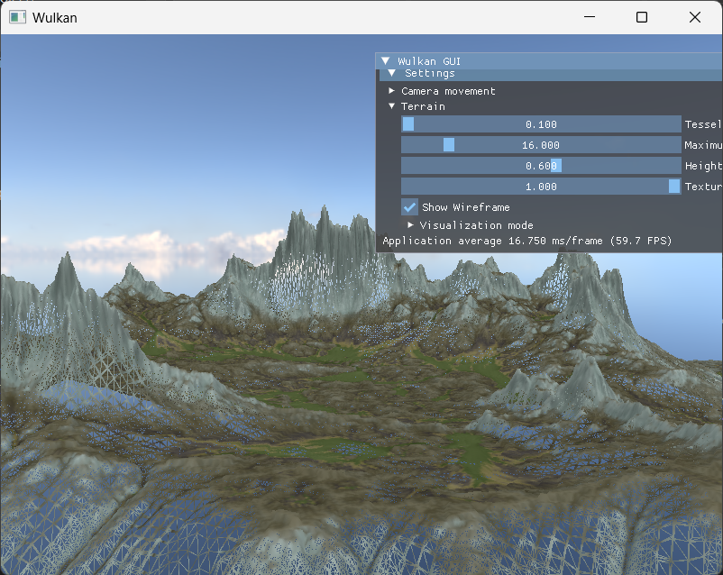
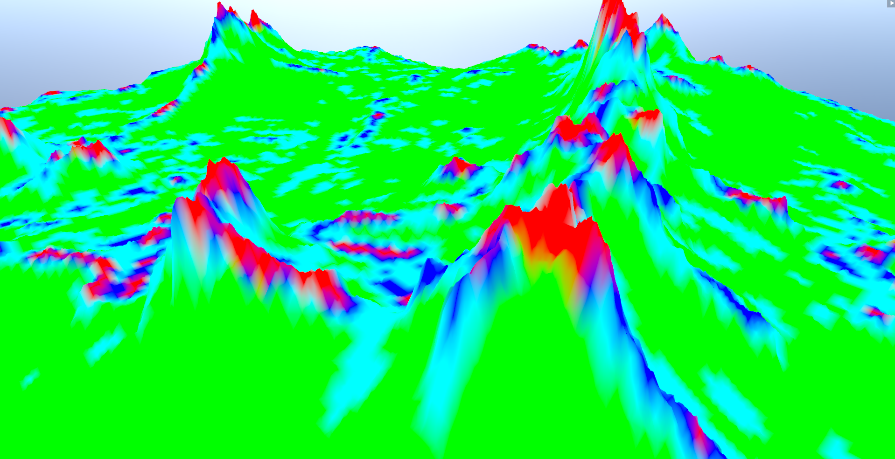
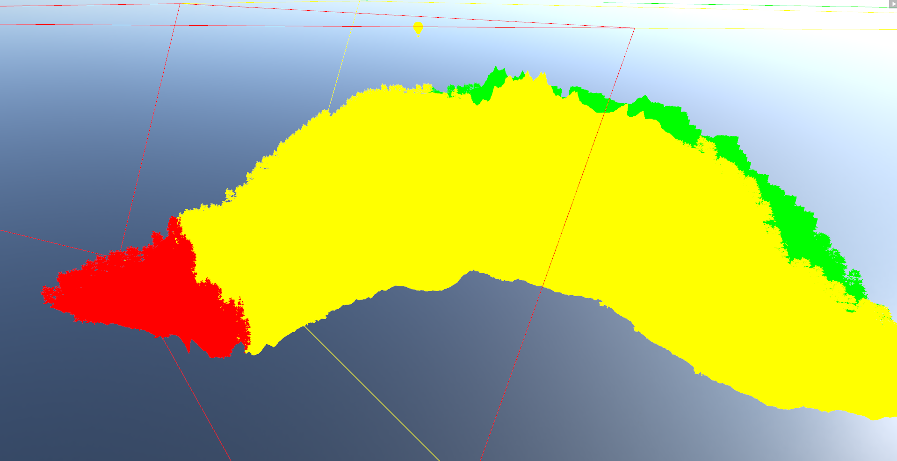

<link rel="stylesheet" type="text/css" href="/beerslider/BeerSlider.css">

For this project, I build a real time renderer (rasterizer) in Vulkan. Part of the motivation being to learn a lower level / more modern graphics API another being to imitate an image me and my group partner created for the rendering competition at ETH ([click here]() to go to the page about that project). The renderer is a simple forward renderer using Vulkan 1.3 using Dynamic Rendering.

<!-- 

Mention github project, 
learning vulkan
trying to mimick the visual of a raytracer made at eth

-->

## Terrain system

<table>
  <tr>
    <td>
      
    </td>
    <td>
      
    </td>
  </tr>
  <tr>
    <td colspan="2">
      <em>Shows the wireframe of the terrain (left) and a visualization of tesselation strength (right)</em>
    </td>
  </tr>
</table>

The terrain uses a height map (along with other maps for visuals). To reduce triangles we don't just want a uniform grid and to then adjust the height based on the texture., but want to support a coarse mesh which is dynamically tesselated using hardware. There are two factors we care about when deciding how much we want to tesselate a terrain patch. The first one being how close the camera is to the patch and the other how much change in height happens within the patch. Whilst distance is easy to compute, how do we quantify the latter part.

Well this sounds a lot like curvature. Something that is easy for 2d functions but a bit more complicated for meshes (or 3d height functions). When loooking into it, we recall the two different curavtures mean and gaussian curavture. Given the principle curvatures \(k_1\) and \(k_2\) (the minimal and maximal curvature of the surface projected on to a tangent plane; see [Wikipedia](https://en.wikipedia.org/wiki/Principal_curvature) for more details), we can compute mean curvature \(H\) and Gaussian curvature \(K\) as follows (in the contiguous case):

<!-- Define gaussian and mean curavutre -->
\[
\begin{aligned}
H &= \frac{k_1 + k_2}{2} \\
K &= k_1 * k_2 
\end{aligned}
\]

We do not want to use gaussian curvature because its zero if either \(k_1\) or \(k_2\) is zero even if there is non zero curvature in the other principle direction. So we want to use mean curvature, but now the question is how do we compute that given our height map. Given our height map \(h(u,v)\) and its first order \(h_u, h_v\) and second order derivatives \(h_{uu}, h_{vv}, h_{uv}\), computed using finite difference, we can compute mean curvature as:

\[
H = \frac{h_{uu} (1 + h_v^2) - 2h_{uv} h_u h_v + h_{vv} (1 + h_u^2)}{2 (1 + h_u^2 + h_v^2)^{3/2}}
\]

We can precompute the curvature on initialization and then we only require one texture look up. For the details on the computation of mean curvature look at [Adaptive Hardware-accelerated Terrain Tessellation](https://www.diva-portal.org/smash/get/diva2:617225/FULLTEXT01.pdf).

## Shadows
The idea of cascaded shadow maps is to split the shadow frustum such that closer to the camera the shadows have higher resolutions than far away and thus keeping the error similar. We only support directional lights / shadows currently.

 
 Visualize a camera and the different frustums.

In the above image we can see given a camera frustum (outside the image on the left) how 3 cascades would look with red having the highest resolution. We render the scene with an orthogonal projection for each cascade only storing the depth value in a texture array. Later on if we want to check if a fragment is in shadow, we first calculate in which cascade it belongs (number of cascades given as a specialization constant) and can then compare it's depth from the light source to the depth stored in the texture. Instead of sampling (eg. linearly interpolating the 4 texels) and then comparing to the depth, we instead compare each texel and interpolate the comparison values (0 or 1). This could already be seen as a sort of soft shadow but is always used (fixed size penumbra) For more details on cascaded shadow maps, read [Nvidia's paper](https://developer.download.nvidia.com/SDK/10.5/opengl/src/cascaded_shadow_maps/doc/cascaded_shadow_maps.pdf).

  

  

    
  

To implement soft shadows, we take multiple samples around the uv of the projected texels. How much we offset depends on the average distance between an occluder an the light source (again mutliple samples used). Especially on the receiver sampling, we want good sampling patterns that do not introduce aliasing or more blockiness. In this implementation we use rotated vogel disk samples with the seed for the rotation given by the screen position. For more details on the soft shadow implementation used, read [Contact-hardening Soft Shadows Made Fast](https://wojtsterna.com/wp-content/uploads/2023/02/contact_hardening_soft_shadows.pdf).

  

  

    
  

This project is hosted on [Github](https://github.com/Klark007/Wulkan).